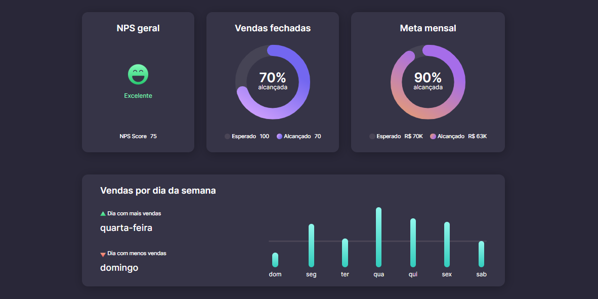

<h1 align="center"> Dashboard com SVG </h1>

Desafio 08 do #boracodar da Rocketseat  

## 🚀 Tecnologias

Esse projeto foi desenvolvido com as seguintes tecnologias:

- HTML, CSS e SVG
- Figma

## 📚 O que aprendemos nesse desafio

# CSS

- aplicar variável pelo atributo HTML
- animations / @keyframes
- column-gap / row-gap
- grid-template-columns / grid-template-rows / grid-column / grid-auto-flow
- fit-content
- margin-top: auto
- place-content / align-self / justify-items / justify-content
- centralizar div com position/grid/flex/margin
- :nth-child() / ::before
- transform / matrix() / rotate()
- stroke / dasharray / dashoffset / stroke-width / linecap
- fill
- responsividade / mobile first / @media
- clip-path / polygon
- linear-gradient()
- calc()

# SVG

- viewBox
- circle
- cx / cy
- r
- stroke
- defs
- linearGradient
